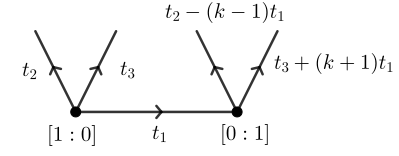

# BPS numbers (Table 5.1)

In this section, we provide code that generates Table 5.1 in the accompanying article.
Let $X_k$ be as in the article.
Recall that it has the following GKM graph, with $t_1+t_2+t_3 = 0$, as depicted in Figure 5.1 of the accompanying paper:



Then equation (5.11) expresses the genus zero degree $d$ BPS numbers of $X_k$ as

```math
n_{0,d\mathbf{0}_{X_k}}(X_k) =
    \frac{1}{d^3 k^2}\sum_{e\mid d} \mu(d/e)(-1)^{(k+1)e+1}\binom{k^2 e}{e}.
```

Table 5.1 is obtained from this formula using the following code.

```jldoctest Table_5_1
julia> include("test/GW/examples/mobius.jl")
print_BPS_table (generic function with 1 method)

julia> print_BPS_table(5, 7)
k = 1:  -1      0       0       0       0       0        0
k = 2:  1       -1      2       -7      31      -156     863
k = 3:  -1      -2      -12     -102    -1086   -13284   -179226
k = 4:  1       -4      40      -620    12020   -268248  6601292
k = 5:  -1      -6      -100    -2450   -75050  -2647580 -102998030
```

The code of `test/GW/examples/mobius.jl` is as follows:

```julia
# Return BPS state using Gromov--Witten invariants and Gopakumar--Vafa formula.
function BPS_states(k::Int64, dMax::Int64; printStuff::Bool = true)
  Nd = [(-1)^( (k+1)*d + 1 ) // (k^2 * d^3) * binomial(k^2 * d, d) for d in 1:dMax]
  nd = Vector(undef, dMax)
  for d in 1:dMax
    nd[d] = Nd[d]
    for e in 1:(d-1)
      !(divides(d, e)[1]) && continue
      # e divides d and e < d.
      nd[d] -= 1//(d // e)^3 * nd[e]
    end
    if denominator(nd[d] == 1)
      nd[d] = numerator(nd[d])
    end
  end
  printStuff && println("k = $k")
  printStuff && println("Nd = $Nd")
  printStuff && println("nd = $nd")
  return nd
end

# Return BPS state using Mobius inversion.
function BPS_state_mobius(k::Int64, d::Int64)
  r = 0
  for e in 1:d
    !(divides(d, e)[1]) && continue
      # e divides d and e < d.
    m = mobius(e)
    de = Int64(d//e)
    m == 0 && continue
    r += m * (-1)^( (k+1)*de + 1 ) * binomial(k^2 * de, de)
  end
  r //= d^3 * k^2
  if denominator(r) == 1
    return numerator(r)
  end
  return r
end

# Return the Mobius function evaluated at n.
function mobius(n::Int64)
  m = 1
  for f in factor(n)
    f[2] > 1 && return 0
    m *= -1
  end
  return m
end

# Print the Table 5.1.
function print_BPS_table(kMax::Int64, dMax::Int64; latex::Bool=false)
  for k in 1:kMax
    nd = BPS_states(k, dMax; printStuff=false)
    for d in 1:dMax
      @req nd[d] == BPS_state_mobius(k, d) "BPS states disagree for d=$d, k=$k"
    end
    if latex
      print("\$$k\$ & ")
      for d in 1:dMax
        print("\$$(nd[d])\$")
        d != dMax && print(" & ")
      end
      println(" \\\\\\hline")
    else
      print("k = $k:\t")
      for d in 1:dMax
        print("$(nd[d])\t")
      end
      println()
    end
  end
end
```