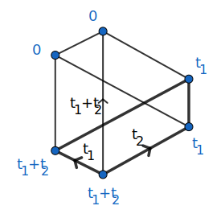
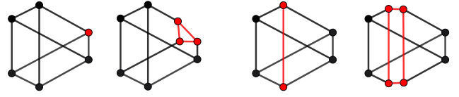

# Operators

## GKM Subgraphs
The following figure shows the GKM subgraph of a Schubert variety $X_w$ in the full flag variety of $\mathbb{C}^3$.
Edge labels are illustrate the axial function, while the vertex labels describe the equivariant Poincaré dual of $X_w$ via localization.

```@docs
gkm_subgraph_from_vertices
gkm_subgraph_from_edges
isvalid(::GKMtools.AbstractGKM_subgraph; ::Bool)
```

## Blowups
The following figure illustrates the effect of blowups along a GKM subgraph (red) on the underlying graph.

```@docs
blow_up
```

## Products
```@docs
*(::GKMtools.AbstractGKM_graph, ::GKMtools.AbstractGKM_graph)
```