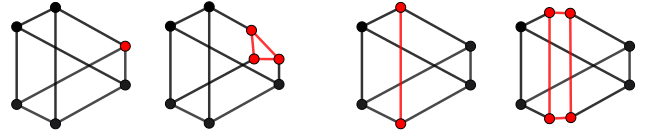

# Blowup
The following figure illustrates the effect of blowups along a GKM subgraph (red) on the underlying graph.


## Blowups of smooth and Orbifold GKM graphs
```@docs
blow_up
```

We can blow up also Orbifold GKM graphs.
TODO: check this example:
```jldoctest
julia> W = stacky_weighted_projective_space_fan([1, 2, 3, 4]);

julia> Wp = gkm_graph_of_orbifold_toric(W);

julia> s = subgraph_from_vertices(Wp, [1]);

julia> blow_up(s)
GKM subgraph of:
Orbifold GKM graph with 6 nodes, valency 3 and axial function:
[1>3] -> [1>4] => (1, -1, 0, 1)
[1>2] -> [1>4] => (1, 0, -1, 2)
[1>2] -> [1>3] => (0, 1, -1, 1)
2 -> [1>2] => (0, 0, -1, 4)
3 -> [1>3] => (0, -1, 0, 3)
3 -> 2 => (0, -4, 3, 0)
4 -> [1>4] => (-1, 0, 0, 2)
4 -> 2 => (-2, 0, 1, 0)
4 -> 3 => (-3, 2, 0, 0)
Vertex Isotropy:
2 => Orbifold Vertex Isotropy, Group Structure (cyclic factors): [4]
  Tangent Representation: 
[1   3   2]
3 => Orbifold Vertex Isotropy, Group Structure (cyclic factors): [3]
  Tangent Representation: 
[1   1   2]
4 => Orbifold Vertex Isotropy, Group Structure (cyclic factors): [2]
  Tangent Representation: 
[1   0   1]
Flag Isotropy:
2.3 => Orbifold Flag Isotropy, Group Structure (cyclic factors): [2]
  Embedding Matrix: 
[2]
4.2 => Orbifold Flag Isotropy, Group Structure (cyclic factors): [2]
  Embedding Matrix: 
[1]
Algorithmic connection for GKM graph with 6 nodes and valency 3
Subgraph:
Orbifold GKM graph with 3 nodes, valency 2 and axial function:
[1>3] -> [1>4] => (1, -1, 0, 1)
[1>2] -> [1>4] => (1, 0, -1, 2)
[1>2] -> [1>3] => (0, 1, -1, 1)
Vertex Isotropy:
Flag Isotropy:
Algorithmic connection for GKM graph with 3 nodes and valency 2
```

## Weighted blowups
TODO: add preliminaries on weighted blowups.

We construct the weighted blowup of the affine space $\mathbb{A}^4$ with weights `weights = [1, 2, 3, 4]`. We show that the result has exceptional divisor isomorphic to the weighted projective space $\mathbb{P}^3(1, 2, 3, 4)$.
```jldoctest weighted_blow_up
julia> A4_toric = affine_space(NormalToricVariety, 4);

julia> A4_GKM = gkm_graph_of_toric(A4_toric);

julia> sub_A4 = subgraph_from_vertices(A4_GKM, [1]);

julia> blow_A4 = blow_up(sub_A4, [1, 2, 3, 4]);

julia> subgraph(blow_A4)
Orbifold GKM graph with 4 nodes, valency 3 and axial function:
[1>F2] -> [1>F1] => (2, -1, 0, 0)
[1>F3] -> [1>F1] => (3, 0, -1, 0)
[1>F3] -> [1>F2] => (0, 3, -2, 0)
[1>F4] -> [1>F1] => (4, 0, 0, -1)
[1>F4] -> [1>F2] => (0, 2, 0, -1)
[1>F4] -> [1>F3] => (0, 0, 4, -3)
Vertex Isotropy:
[1>F2] => Orbifold Vertex Isotropy, Group Structure (cyclic factors): [2]
  Tangent Representation: 
[1   1   0]
[1>F3] => Orbifold Vertex Isotropy, Group Structure (cyclic factors): [3]
  Tangent Representation: 
[1   2   1]
[1>F4] => Orbifold Vertex Isotropy, Group Structure (cyclic factors): [4]
  Tangent Representation: 
[1   2   3]
Flag Isotropy:
[1>F2].3 => Orbifold Flag Isotropy, Group Structure (cyclic factors): [2]
  Embedding Matrix: 
[1]
[1>F4].2 => Orbifold Flag Isotropy, Group Structure (cyclic factors): [2]
  Embedding Matrix: 
[2]
Algorithmic connection for GKM graph with 4 nodes and valency 3
```
Let us construct the weighted projective space $\mathbb{P}^3(1, 2, 3, 4)$.
```jldoctest weighted_blow_up
julia> W = stacky_weighted_projective_space_fan([1, 2, 3, 4]);
julia> Wp = gkm_graph_of_orbifold_toric(W)
Orbifold GKM graph with 4 nodes, valency 3 and axial function:
2 -> 1 => (0, 0, -1, 4)
3 -> 1 => (0, -1, 0, 3)
3 -> 2 => (0, -4, 3, 0)
4 -> 1 => (-1, 0, 0, 2)
4 -> 2 => (-2, 0, 1, 0)
4 -> 3 => (-3, 2, 0, 0)
Vertex Isotropy:
2 => Orbifold Vertex Isotropy, Group Structure (cyclic factors): [4]
  Tangent Representation: 
[2   3   1]
3 => Orbifold Vertex Isotropy, Group Structure (cyclic factors): [3]
  Tangent Representation: 
[2   1   1]
4 => Orbifold Vertex Isotropy, Group Structure (cyclic factors): [2]
  Tangent Representation: 
[1   0   1]
Flag Isotropy:
2.1 => Orbifold Flag Isotropy, Group Structure (cyclic factors): [2]
  Embedding Matrix: 
[2]
4.2 => Orbifold Flag Isotropy, Group Structure (cyclic factors): [2]
  Embedding Matrix: 
[1]
Algorithmic connection for GKM graph with 4 nodes and valency 3
```
The two constructions coincides after reodering the vertices and flags: `(1, 2, 3, 4)` correspond to `[1>F1], [1>F4], [1>F3], [1>F2]`.
