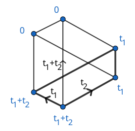

# Subgraph
The following figure shows the GKM subgraph of a Schubert variety $X_w$ in the full flag variety of $\mathbb{C}^3$.
Edge labels illustrate the axial function, while the vertex labels describe the equivariant Poincaré dual of $X_w$ via localization.

```@docs
subgraph_from_vertices
ambient_graph
subgraph
vertex_to_ambient
ambient_to_vertex
poincare_dual
```